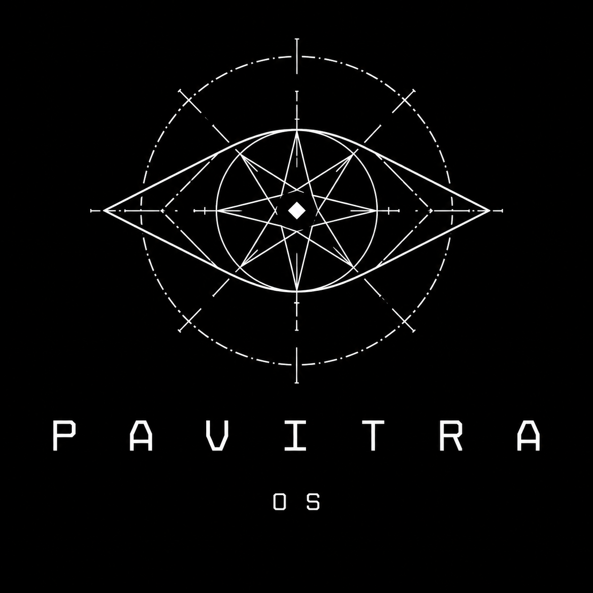

<div align="center">
  
  <h1>Pavitra OS</h1>
  <p><strong>Run Everything. Pure Linux.</strong></p>

  <p>
    
    
    
    
  </p>

  <p>
    A custom Linux distribution that lets you run Windows, macOS, Debian, and native Linux applications — all from one machine, with zero compromise on control.
  </p>
</div>

---

## What is Pavitra OS?

Pavitra OS is a custom live operating system built on **Debian 12 Bookworm**. It ships four complete application ecosystems out of the box, letting you run virtually any software on a pure, open-source Linux foundation.

| Ecosystem | Runtime | How to Use |
|---|---|---|
| **Windows** `.exe` | Wine 9 | `run-windows-app program.exe` |
| **macOS** `.app` | Darling | `run-macos-app App.app` |
| **Debian** `.deb` | Native APT | `install-deb package.deb` |
| **AppImage** | AppImage daemon | `appimage-run App.AppImage` |
| **Linux ELF** | Native | `./binary` — 32-bit and 64-bit |

---

## Features

- **Zero friction compatibility** — drag any app onto the Pavitra App Runner and it auto-detects the format and launches it
- **XFCE4 desktop** — lightweight, fast, and fully themed
- **Pre-installed suite** — Firefox, LibreOffice, GIMP, VLC, Thunar, XFCE Terminal
- **Flatpak + Flathub** — access thousands of apps from GNOME Software
- **UFW firewall** — enabled by default, deny-incoming / allow-outgoing
- **zram compressed swap** — 50% RAM compression with LZ4 for better performance
- **Unattended security updates** — Debian security repository only
- **Custom Plymouth boot splash** — Pavitra branded boot animation
- **Custom GRUB theme** — styled BIOS boot menu

---

## Screenshots

> Boot into the GRUB menu, through Plymouth, to the XFCE4 desktop.

| GRUB Menu | Plymouth Splash | Desktop |
|---|---|---|
| *BIOS boot menu with Pavitra theme* | *Sacred geometry animated logo* | *XFCE4 with Pavitra wallpaper* |

---

## Building from Source

> **Requirements:** Debian 12 host, `live-build`, `xorriso`, `grub-common`, `squashfs-tools`, `qemu` (for testing)

### 1. Set up the build environment

```bash
git clone https://github.com/brighteyekid/Pavitra-OS.git
cd Pavitra-OS
sudo bash pavitra-os/setup-build-env.sh
```

### 2. Build the base live filesystem (~45-90 min)

```bash
sudo bash pavitra-os/build-base.sh
```

This uses `live-build` to construct the full Debian root filesystem with all compatibility layers installed.

### 3. Inject branding

```bash
sudo bash pavitra-os/inject-branding.sh
```

Patches Plymouth theme, LightDM greeter, `os-release`, wallpaper, and hostname into the squashfs without a full rebuild.

### 4. Generate the bootable ISO

```bash
sudo bash pavitra-os/build-final-iso.sh
```

Produces `pavitra-os/pavitra-os-1.0.iso` (~4.9GB).

### 5. Test in QEMU

```bash
sudo bash pavitra-os/test-in-qemu.sh
```

---

## Repository Structure

```
Pavitra-OS/
├── pavitra-os/
│   ├── assets/                    Brand assets (logo, wallpaper)
│   ├── pavitra-build/
│   │   └── config/
│   │       ├── hooks/             live-build chroot hooks
│   │       │   ├── desktop-setup.hook.chroot   XFCE4, LightDM, user setup
│   │       │   ├── wine-setup.hook.chroot       Wine 9 installation
│   │       │   ├── darling-setup.hook.chroot    macOS compat layer
│   │       │   └── linux-compat.hook.chroot     AppImage, ELF compat
│   │       ├── package-lists/     APT package lists for live-build
│   │       ├── archives/          Custom APT sources
│   │       └── apt/               APT configuration
│   ├── build-base.sh              Main live-build orchestrator
│   ├── build-final-iso.sh         ISO generation (xorriso + grub-mkimage)
│   ├── inject-branding.sh         Surgical squashfs branding injection
│   ├── rebuild-iso-branded.sh     Lightweight ISO rebuild after branding
│   ├── setup-build-env.sh         Host dependency installer
│   └── test-in-qemu.sh            QEMU test runner
├── docs/                          End-user documentation
│   ├── getting-started.txt
│   ├── faq.txt
│   ├── changelog.txt
│   ├── windows-compat.txt
│   ├── macos-compat.txt
│   └── ...
├── website/                       Official landing page
│   ├── index.html
│   └── style.css
└── LICENSE
```

---

## Default Credentials

| Field | Value |
|---|---|
| Username | `pavitra` |
| Password | `pavitra` |

> Change your password on first boot with `passwd`.

---

## Default Applications

| App | Purpose |
|---|---|
| Firefox ESR | Web browser |
| LibreOffice | Office suite |
| GIMP | Image editing |
| VLC | Media player |
| Thunar | File manager |
| XFCE4 Terminal | Terminal emulator |
| GParted | Disk partitioning |
| GNOME Software | App store (Flatpak) |

---

## Technical Details

- **Base:** Debian GNU/Linux 12 (Bookworm)
- **Kernel:** 6.1.0-48-amd64
- **Desktop:** XFCE4
- **Display Manager:** LightDM + GTK Greeter
- **Boot:** BIOS/MBR via GRUB 2 (UEFI extension planned)
- **ISO Format:** ISO 9660 Level 3 (supports files >4GB)
- **Compression:** xz (squashfs)
- **Build Tool:** live-build (Debian)
- **Wine Version:** 9.x (winehq-stable)
- **Darling:** Built from source (macOS/Darwin API layer)

---

## Contributing

Pull requests welcome. For major changes, open an issue first.

1. Fork the repo
2. Create a feature branch: `git checkout -b feature/my-fix`
3. Commit: `git commit -m 'Add my fix'`
4. Push: `git push origin feature/my-fix`
5. Open a Pull Request

---

## License

GPL-2.0. See [LICENSE](LICENSE) for details.

Pavitra OS does not include any proprietary code from Apple, Microsoft, or any other company. Wine and Darling are open-source reimplementations of their respective APIs.
